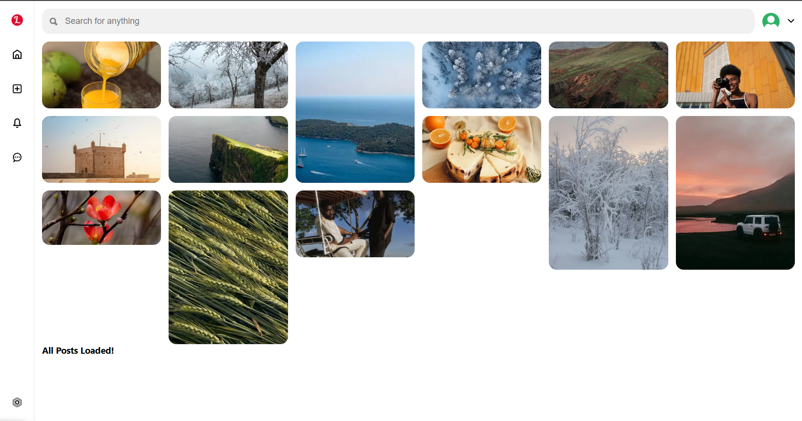

# Pinterest Clone

A full-stack web application that mimics core Pinterest functionality, allowing users to discover, save, and share visual content.

## 📋 Features

- **User Authentication**: Register and login functionality with JWT authentication
- **Content Discovery**: Browse visual content in a Pinterest-style masonry grid layout
- **Profile Management**: View and edit user profiles
- **Social Interactions**: Follow users, like and save pins, comment on posts
- **Content Creation**: Upload and customize images with text overlays
- **Content Organization**: Create boards to organize saved pins
- **Search Functionality**: Search for pins by title or tags

## 🏗️ Architecture

### Frontend
- React.js with React Router for client-side navigation
- State management with Zustand (editorStore, authStore)
- React Query for data fetching and caching
- Lazy loading for optimized performance

### Backend
- Node.js with Express.js
- MongoDB database with Mongoose ODM
- JWT for authentication
- ImageKit for image processing and storage

## 🔧 Technical Stack

### Frontend
- **React**: UI library
- **React Router**: Client-side routing
- **Zustand**: Lightweight state management
- **TanStack Query**: Data fetching and caching
- **CSS**: Custom styling

### Backend
- **Node.js**: Runtime environment
- **Express.js**: Web framework
- **MongoDB**: NoSQL database
- **Mongoose**: ODM for MongoDB
- **JWT**: Authentication
- **bcrypt.js**: Password hashing
- **Sharp**: Image processing
- **ImageKit**: Image hosting and transformations

## 📁 Project Structure

### Frontend
```
Frontend/
├── src/
│   ├── Components/
│   │   ├── Editor/             # Image editing functionality
│   │   ├── Gallery/            # Pin display grid
│   │   ├── Image/              # Image component
│   │   ├── LeftBar/            # Navigation sidebar
│   │   ├── TopBar/             # Top navigation bar
│   │   ├── PostInteractions/   # Like, save functionality
│   │   ├── Comments/           # Comments section
│   │   └── Boards/             # User boards display
│   ├── Routes/
│   │   ├── AuthPage/           # Login/Register
│   │   ├── CreatePage/         # Pin creation
│   │   ├── HomePage/           # Main feed
│   │   ├── Layouts/            # Page layouts
│   │   ├── PostPage/           # Single pin view
│   │   ├── ProfilePage/        # User profile
│   │   └── SearchPage/         # Search results
│   ├── Utility/
│   │   ├── apiRequest.js       # API client
│   │   ├── authStore.js        # Authentication state
│   │   └── editorStore.js      # Editor state
│   ├── main.jsx                # App entry point
│   └── index.css               # Global styles
```

### Backend
```
Backend/
├── Controller/
│   ├── board.controller.js     # Board management
│   ├── comment.controller.js   # Comment functionality
│   ├── pin.controller.js       # Pin CRUD operations
│   └── user.controller.js      # User authentication & profile
├── Models/
│   ├── board.model.js          # Board schema
│   ├── comment.model.js        # Comment schema
│   ├── follow.model.js         # User follows
│   ├── like.model.js           # Pin likes
│   ├── pin.model.js            # Pin schema
│   ├── save.model.js           # Saved pins
│   └── user.model.js           # User schema
├── Routes/
│   ├── board.route.js          # Board endpoints
│   ├── comment.route.js        # Comment endpoints
│   ├── pin.route.js            # Pin endpoints
│   └── user.route.js           # User endpoints
├── Utilities/
│   └── connectDB.js            # Database connection
└── index.js                    # Server entry point
```

## 🚀 Getting Started

### Prerequisites
- Node.js (v14 or higher)
- MongoDB
- ImageKit account

### Installation

1. Clone the repository
```bash
git clone https://github.com/yourusername/pinterest-clone.git
cd pinterest-clone
```

2. Install backend dependencies
```bash
cd Backend
npm install
```

3. Install frontend dependencies
```bash
cd ../Frontend
npm install
```

4. Create a `.env` file in the Backend directory with the following variables:
```
PORT=3000
MONGODB_URI=your_mongodb_connection_string
JWT_TOKEN=your_secret_jwt_key
CLIENT_URL=http://localhost:5173
IMAGEKIT_PUBLIC_KEY=your_imagekit_public_key
IMAGEKIT_PRIVATE_KEY=your_imagekit_private_key
IMAGEKIT_URL_ENDPOINT=your_imagekit_url_endpoint
```

5. Start the backend server
```bash
npm start
```

6. Start the frontend development server
```bash
cd ../Frontend
npm run dev
```

7. Open your browser and navigate to `http://localhost:5173`

## 💡 Key Features Explained

### Image Upload and Editing
The application allows users to upload images and customize them with text overlays. The Editor component provides a workspace with text positioning, color selection, and canvas customization.

### Authentication Flow
The application uses JWT tokens stored in HTTP-only cookies for secure authentication. Registration and login forms are provided in the AuthPage component.

### Social Interactions
Users can:
- Follow/unfollow other users
- Like and save pins
- Comment on pins
- Create and organize boards for saved pins

### Responsive Design
The application is designed to work across various screen sizes, with responsive layouts for the pin grid and post views.

## 🧪 Testing

Instructions for running tests (coming soon)

## 🤝 Contributing

1. Fork the repository
2. Create your feature branch (`git checkout -b feature/amazing-feature`)
3. Commit your changes (`git commit -m 'Add some amazing feature'`)
4. Push to the branch (`git push origin feature/amazing-feature`)
5. Open a Pull Request

## 📄 License

This project is licensed under the MIT License - see the LICENSE file for details.

## 🙏 Acknowledgments

- Inspiration: Pinterest
- Icons and assets from [source]